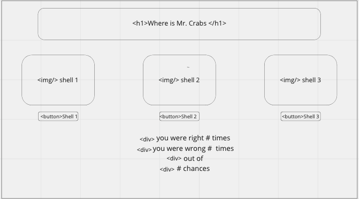

)

## The Golden Rule:

🦸 🦸‍♂️ `Stop starting and start finishing.` 🏁

If you work on more than one feature at a time, you are guaranteed to multiply your bugs and your anxiety.

## Making a plan

1. **Make a drawing of your app. Simple "wireframes"** COMPLETE
    //complete
1. **Look at the drawing and name the HTML elements you'll need to realize your vision** COMPLETE
    //<h1> for title
    //'s of 3 shells
        //pink, blue, orange
    //<button>'s for 3 shells
        //pink-shell-button
        //blue-shell-button
        //orange-shell-button
    //
's for:
        //# right
        //# wrong
        //out of
        //# chances
1. **Look at the drawing and imagine using the app. What _state_ do you need to track?**
    //# of clicks
1. **For each HTML element ask: Why do I need this? (i.e., "we need div to display the results in")**
    //<h1> to give a title
    //'s of the 3 shells
        //pink, blue, orange
    //<button>'s for 3 shells for user to guess the hiding spot of Mr. Crabs
        //pink-shell-button
        //blue-shell-button
        //orange-shell-button
    //
's to display results of:
        //# right
        //# wrong
        //out of
        //# chances
1. **Once we know _why_ we need each element, think about how to implement the "Why" as a "How" (i.e., `resultsEl.textContent = newResults`)**
    //main section elements in html and their 'how'
        images: of shells in a div's to give class and id to reference in JS
        buttons: for user to choose which shell they think mr. crabs is in
        div's: to show the states and program how to view (#'s) will change after 'click' event listeners
1. **Find all the 'events' (user clicks, form submit, on load etc) in your app. Ask one by one, "What happens when" for each of these events. Does any state change? Does any DOM update?**
    //eventListeners for buttons
    //formulas to calculate #'s for the 3 div's
    //hide/move the crab after a guess
    //add the crab to the correct guess

1. **Think about how to validate each of your features according to a Definition of Done. (Hint: console.log usually helps here.)**
    //console.log as dom elements are manipulated or formulas are put in
1. **Consider what features _depend_ on what other features. Use this dependency logic to figure out what order to complete tasks.**
    //JS depends on HTML, do HTML first
    //CSS styling to get layout right
    //get dom elements - buttons, divs, spans
    //state 
        let correctGuesses = 0
        let incorrectGuesses = 0
        let totalGuesses = 0
    //events
        clickEvents

Additional considerations:

-   Ask: which of your HTML elements need to be hard coded, and which need to be dynamically generated?
-   Consider your data model.
    -   What kinds of objects (i.e., Dogs, Friends, Todos, etc) will you need?
    -   What are the key/value pairs?
    -   What arrays might you need?
            //const hidingSpot = (orange-shell, blue-shell, pink-shell)
    -   What needs to live in a persistence layer?
-   Is there some state we need to initialize?
-   Ask: should any of this work be abstracted into functions? (i.e., is the work complicated? can it be reused?)
